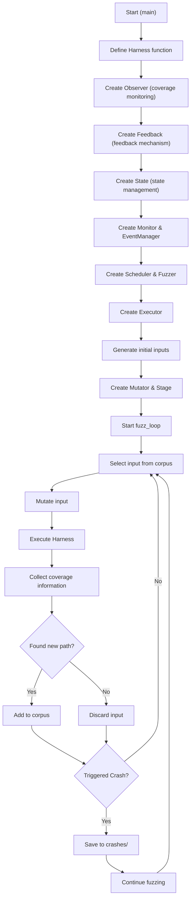

# LibAFL Baby Fuzzer - main.rs Detailed Explanation

## Code Overall Structure

This is a minimalist LibAFL fuzzer based on the official tutorial, designed to demonstrate LibAFL's core concepts. It automatically discovers inputs that cause panics.

---

## Part 1: Imports and Global Variables (Lines 1-30)

### Import Modules

```rust
use std::{path::PathBuf, ptr::write};
use libafl::monitors::SimpleMonitor;
use libafl::{
    corpus::{InMemoryCorpus, OnDiskCorpus},      // Corpus
    events::SimpleEventManager,                  // Event manager
    executors::{ExitKind, InProcessExecutor},    // Executor
    feedbacks::{CrashFeedback, MaxMapFeedback},  // Feedback mechanisms
    fuzzer::{Fuzzer, StdFuzzer},                 // Fuzzer
    generators::RandPrintablesGenerator,         // Initial input generator
    inputs::{BytesInput, HasTargetBytes},        // Input types
    mutators::{havoc_mutations::havoc_mutations, 
               scheduled::HavocScheduledMutator}, // Mutator
    observers::ConstMapObserver,                 // Observer (coverage monitoring)
    schedulers::QueueScheduler,                  // Scheduler
    stages::mutational::StdMutationalStage,      // Mutation stage
    state::StdState,                             // State management
};
use libafl_bolts::{
    current_nanos, nonnull_raw_mut, nonzero, rands::StdRand, 
    tuples::tuple_list, AsSlice,
};
```

### Global Coverage Map

```rust
const SIGNALS_LEN: usize = 16;
static mut SIGNALS: [u8; SIGNALS_LEN] = [0; SIGNALS_LEN];
static mut SIGNALS_PTR: *mut u8 = &raw mut SIGNALS as _;

fn signals_set(idx: usize) {
    unsafe { write(SIGNALS_PTR.add(idx), 1) };
}
```

**Purpose**:
- `SIGNALS` is a coverage map array used to track code execution paths
- When different branches execute, set the corresponding index position to 1
- `signals_set()` function safely updates the map

---

## Part 2: Target Function Definition (Lines 32-49)

```rust
let mut harness = |input: &BytesInput| {
    let target = input.target_bytes();
    let buf = target.as_slice();
    signals_set(0);  // Enter function, set signal
    
    if !buf.is_empty() && buf[0] == b'a' {
        signals_set(1);  // Path 1: first byte is 'a'
        if buf.len() > 1 && buf[1] == b'b' {
            signals_set(2);  // Path 2: second byte is 'b'
            if buf.len() > 2 && buf[2] == b'c' {
                #[cfg(unix)]
                panic!("Artificial bug triggered =)");  // Path 3: vulnerability found!
            }
        }
    }
    ExitKind::Ok  // Normal exit
};
```

**Purpose**:
- **Harness** is the target function for fuzzing
- Accepts `BytesInput` type input
- Sets signals for coverage feedback
- Panics when input is `"abc"`
- Returns `ExitKind::Ok` indicating normal execution

---

## Part 3: Observer (Observer) (Lines 51-52)

```rust
let observer = unsafe { 
    ConstMapObserver::from_mut_ptr("signals", nonnull_raw_mut!(SIGNALS)) 
};
```

**Purpose**:
- Create an observer to monitor the `SIGNALS` array
- Track coverage changes during program execution
- Name "signals" is used for logging

**Type**: `ConstMapObserver` - Observer based on constant-size map

---

## Part 4: Feedback (Feedback Mechanism) (Lines 54-58)

```rust
// Feedback 1: Coverage feedback (used to select interesting inputs)
let mut feedback = MaxMapFeedback::new(&observer);

// Feedback 2: Crash feedback (used to identify bugs)
let mut objective = CrashFeedback::new();
```

**Purpose**:
- `MaxMapFeedback`: Detects if new code paths are discovered
  - If new path found → Save input to corpus
  - If no new path → Discard input
  
- `CrashFeedback`: Detects program crashes
  - If panic/crash occurs → Save to objective corpus
  - Used to find inputs triggering bugs

---

## Part 5: State (State Management) (Lines 60-75)

```rust
let mut state = StdState::new(
    StdRand::with_seed(current_nanos()),           // Random number generator
    InMemoryCorpus::new(),                          // Main corpus (memory)
    OnDiskCorpus::new(PathBuf::from("./crashes"))?, // Objective corpus (disk)
    &mut feedback,                                  // Coverage feedback state
    &mut objective,                                 // Crash feedback state
).unwrap();
```

**Purpose**:
- `State` is LibAFL's global state container
- Stores all data that needs to be persisted
- **Parameter explanations**:
  1. RNG: Random number generator for mutations
  2. Corpus: Save discovered interesting inputs
  3. OnDiskCorpus: Where to save crash inputs
  4. Feedback state: Running state of feedback mechanism
  5. Objective state: Running state of objective feedback

---

## Part 6: Monitor and EventManager (Monitoring and Events) (Lines 77-82)

```rust
let mon = SimpleMonitor::new(|s| println!("{s}"));
let mut mgr = SimpleEventManager::new(mon);
```

**Purpose**:
- `SimpleMonitor`: Display fuzzing progress
  - Output execution statistics, corpus size, coverage, etc.
  
- `SimpleEventManager`: Handle fuzzer events
  - New corpus discovery events
  - New coverage discovery events
  - Target achieved events (like crashes)

---

## Part 7: Scheduler (Scheduler) (Lines 84-85)

```rust
let scheduler = QueueScheduler::new();
let mut fuzzer = StdFuzzer::new(scheduler, feedback, objective);
```

**Purpose**:
- `QueueScheduler`: FIFO queue scheduling
  - Select inputs from corpus sequentially
  
- `StdFuzzer`: Standard fuzzer
  - Combines scheduler, feedback, and objective
  - Coordinates the entire fuzzing process

---

## Part 8: Executor (Executor) (Lines 90-98)

```rust
let mut executor = InProcessExecutor::new(
    &mut harness,              // Target function to execute
    tuple_list!(observer),     // Observer list
    &mut fuzzer,               // Fuzzer
    &mut state,                // State
    &mut mgr,                  // Event manager
).expect("Failed to create the Executor");
```

**Purpose**:
- `InProcessExecutor`: Execute target function in the same process
- Advantages: Fast, simple
- Disadvantages: Target function crash crashes the fuzzer
- Execution flow:
  1. Get input
  2. Call harness function
  3. Collect observer data
  4. Return execution result

---

## Part 9: Generator (Initial Input Generation) (Lines 100-106)

```rust
let mut generator = RandPrintablesGenerator::new(nonzero!(32));

state.generate_initial_inputs(
    &mut fuzzer,
    &mut executor,
    &mut generator,
    &mut mgr,
    8  // Generate 8 initial inputs
).expect("Failed to generate the initial corpus");
```

**Purpose**:
- `RandPrintablesGenerator`: Generate random printable character byte arrays
  - Maximum length: 32 bytes
  
- Generate 8 initial inputs and add to corpus
- These inputs are immediately executed to discover initial coverage

---

## Part 10: Mutator and Stage (Mutation and Stage) (Lines 108-110)

```rust
let mutator = HavocScheduledMutator::new(havoc_mutations());
let mut stages = tuple_list!(StdMutationalStage::new(mutator));
```

**Purpose**:
- `HavocScheduledMutator`: Havoc mutation strategy (AFL's classic method)
  - Includes: bit flip, byte flip, byte delete, byte insert, etc.
  
- `StdMutationalStage`: Mutation stage
  - Mutates inputs and executes them

---

## Part 11: Fuzzing Loop (Fuzzing Loop) (Lines 112-114)

```rust
fuzzer.fuzz_loop(
    &mut stages,        // Mutation stage
    &mut executor,      // Executor
    &mut state,         // State
    &mut mgr            // Event manager
).expect("Error in the fuzzing loop");
```

**Purpose**:
- Start the infinite fuzzing loop
- Each iteration:
  1. Scheduler selects an input from corpus
  2. Stage mutates the input
  3. Executor executes the mutated input
  4. Observer collects coverage information
  5. Feedback determines if interesting
  6. If interesting, add to corpus

---

## Complete Execution Flow Diagram



---

## Key Concepts Quick Reference

| Component | Purpose | Example Type |
|-----------|---------|--------------|
| **Harness** | Target function to test | Closure function |
| **Observer** | Monitor code coverage | `ConstMapObserver` |
| **Feedback** | Determine if input is interesting | `MaxMapFeedback` |
| **Objective** | Identify target events (like crashes) | `CrashFeedback` |
| **State** | Global state container | `StdState` |
| **Corpus** | Test case library | `InMemoryCorpus`, `OnDiskCorpus` |
| **Scheduler** | Select input to test | `QueueScheduler` |
| **Executor** | Execute target function | `InProcessExecutor` |
| **Mutator** | Mutate input | `HavocScheduledMutator` |
| **Stage** | Mutation and execution stage | `StdMutationalStage` |
| **Monitor** | Display progress | `SimpleMonitor` |
| **EventManager** | Handle events | `SimpleEventManager` |
