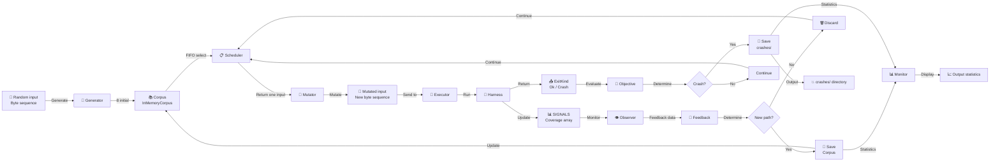
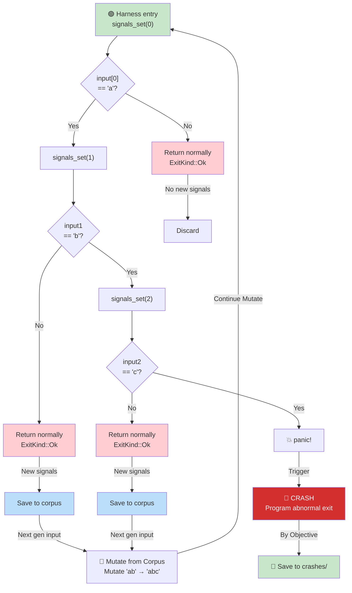
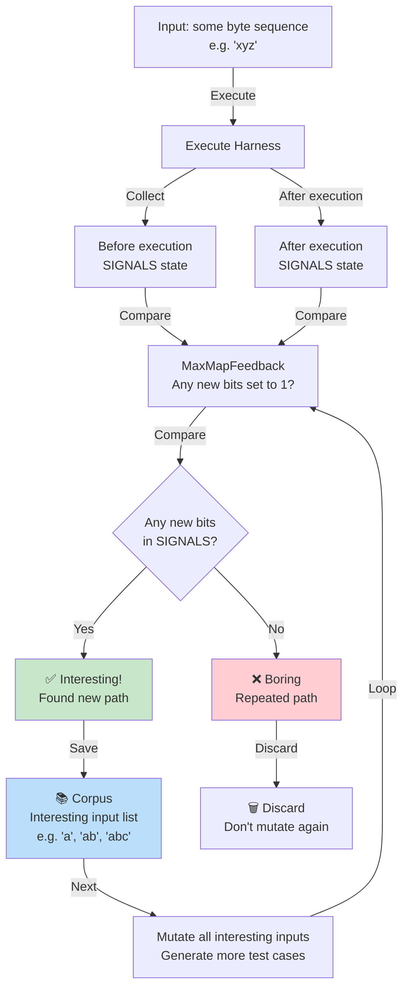
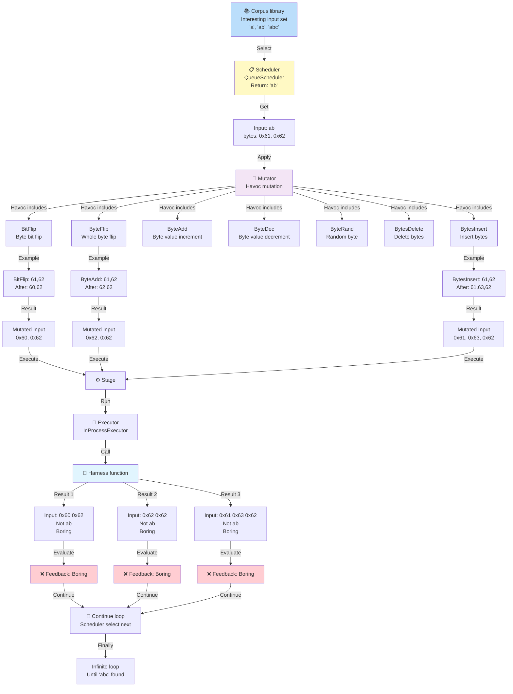

# LibAFL Architecture Diagram Collection

## 1️⃣ Program Execution Flow Diagram (Timeline)

Shows the complete timeline from program startup to vulnerability discovery:

```mermaid
graph TD
    A["🎬 main() starts"] 
    --> B["📝 Define harness function<br/>Goal: panic when input is abc"]
    
    B --> C["👁️ Create Observer<br/>Monitor SIGNALS array"]
    C --> D["💭 Create Feedback<br/>MaxMapFeedback: coverage<br/>CrashFeedback: crashes"]
    D --> E["🎒 Create State<br/>Store: corpus, RNG, feedback state"]
    
    E --> F["📊 Create Monitor & EventMgr<br/>Show statistics, handle events"]
    F --> G["📋 Create Scheduler<br/>QueueScheduler: FIFO selection"]
    G --> H["🔧 Create Executor<br/>InProcessExecutor: in-process execution"]
    
    H --> I["🎲 Generate initial inputs<br/>RandPrintablesGenerator<br/>8 random byte sequences"]
    
    I --> J["🧬 Create Mutator<br/>HavocScheduledMutator<br/>Contains 16 mutation strategies"]
    J --> K["⚙️ Create Stage<br/>StdMutationalStage<br/>Responsible for mutation and execution"]
    
    K --> L["🔄 Start fuzz_loop()"]
    
    L --> M["Loop iteration begins"]
    
    M --> M1["Step 1️⃣<br/>Scheduler selects input<br/>FIFO selection from corpus"]
    M1 --> M2["Step 2️⃣<br/>Mutator mutates input<br/>Randomly modify byte sequence"]
    M2 --> M3["Step 3️⃣<br/>Executor executes<br/>Run harness function"]
    
    M3 --> M4["Step 4️⃣<br/>Observer monitors<br/>Collect SIGNALS array changes"]
    M4 --> M5["Step 5️⃣<br/>Feedback evaluates<br/>Determine if new path found"]
    
    M5 --> M6{"New path<br/>discovered?"}
    M6 -->|No| M8["Discard input<br/>Continue next round"]
    M6 -->|Yes| M7["💾 Save to corpus<br/>corpus count++"]
    
    M7 --> M9{"Triggered<br/>panic?"}
    M8 --> M9
    
    M9 -->|No| M10["Continue loop"]
    M9 -->|Yes| M11["🎯 Vulnerability found!<br/>objectives count++"]
    
    M11 --> M12["💾 Save to crashes/"]
    M12 --> M10
    
    M10 -->|Continue| M
    
    M10 -->|Manual stop| N["📈 Output final statistics<br/>Total executions, corpus size, etc"]
    N --> O["✅ Program ends"]
    
    style M fill:#fff3e0
    style M1 fill:#e3f2fd
    style M2 fill:#e3f2fd
    style M3 fill:#e3f2fd
    style M4 fill:#e3f2fd
    style M5 fill:#e3f2fd
    style M11 fill:#c8e6c9
    style M12 fill:#c8e6c9
```

---

## 2️⃣ Data Flow Diagram

Shows how data flows between components:

---

## 3️⃣ Harness Function Execution Tree

Shows the target function's execution paths and coverage mapping:

---

## 4️⃣ Feedback Mechanism Explained

Shows how coverage feedback guides the search:

---

## 5️⃣ Complete Mutation Process Diagram

Shows one complete mutation execution cycle:

